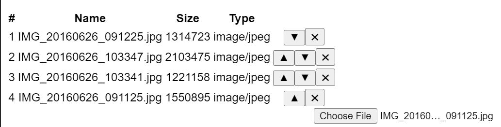

# README

Bare-bones file picker for react with no dependencies (other than `react >= 16.8`) or bells and whistles.
What it does - it allows you to select multiple files and order and / or delete them. That's it.
You can also set a limit on the number of files user can select and the file types.
This package will not install `react` for you. It assumes you will add react dependency
in your `package.json` along-side `react-file-input`. Example screenshot:



# How to use it

Assuming you know how to write a React app:

```
import FileInput from "@siddjain/react-file-input";

export default function App() {
  return (
    <div className="App">
      <FileInput maxFileCount={3} accept=".png,.jpg,.jpeg" />
    </div>
  );
}
```

[Demo](https://codesandbox.io/s/react-file-input-7nbyq0)

# API

`FileInput` takes following optional inputs:

- `onChange`: an event handler that is called whenever the file list changes (addition, deletion or change in order of items in the list)
- `maxFileSize`: a number. units: bytes. If user selects a file whose size is greater than `maxFileSize` a warning symbol is displayed. The file is still selected and added to list of files.
- `accept`: same as [accept](https://developer.mozilla.org/en-US/docs/Web/HTML/Element/input/file#accept). a string that defines the file types the file input should accept.
- `value`: this is useful if you will be using `FileInput` in a multi-step (multi-page) form where user can go back and forth. An array of `File` objects to initialize `FileInput`'s list of files.

# License

[MIT](LICENSE.txt)